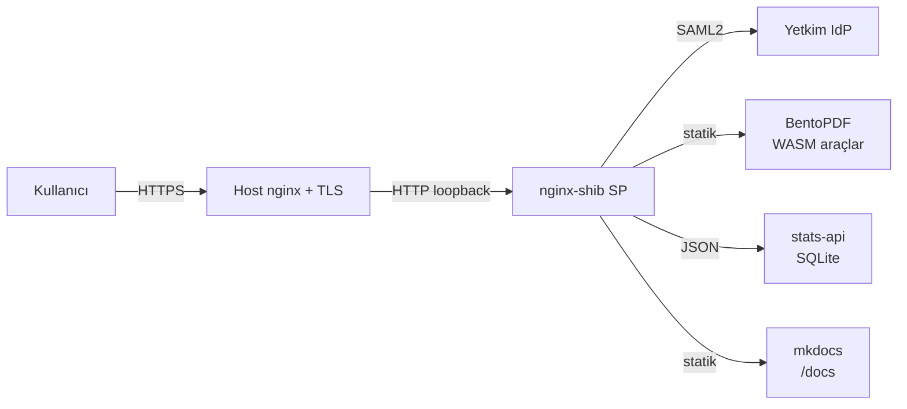

# UlakPDF

Kurum kullanıcılarına Yetkim SSO ile korunan, **tarayıcıda çalışan** bir PDF
araç seti.

## Neden UlakPDF?

- **Gizlilik**: Dosyalar sunucuya yüklenmez, tüm işlemler kullanıcının
  tarayıcısında WebAssembly ile yapılır.
- **Hafif**: Sunucu yalnızca statik içerik servis eder; CPU/RAM ihtiyacı
  benzer araçların onda biri (Stirling-PDF gibi).
- **Kurum SSO**: Erişim Yetkim federasyonu üzerinden Shibboleth SAML2 ile
  korunur. Tek imza ile tüm araçlara erişim.
- **Yönetici görünürlüğü**: Kim, hangi kurumdan, hangi araçları açıyor
  — yöneticilere açık bir özet panel sunulur.

## Hızlı yön

| İhtiyacınız | Sayfa |
|---|---|
| İlk kez giriyorum, nasıl kullanılır? | [Kullanım kılavuzu](kullanim/giris.md) |
| Sunucuya kuracağım | [Kurulum](kurulum/on-hazirlik.md) |
| Yetkim entegrasyonu | [Yetkim IdP entegrasyonu](kurulum/yetkim.md) |
| İstatistik / yönetim | [Yönetici paneli](kullanim/yonetici.md) |
| Mimari nedir? | [Mimari](mimari.md) |

## Yapı

Tüm PDF işleme **tarayıcıda** olur. Sunucu, kimlik doğrulaması ve içerik
servisi dışında bir iş yapmaz.
