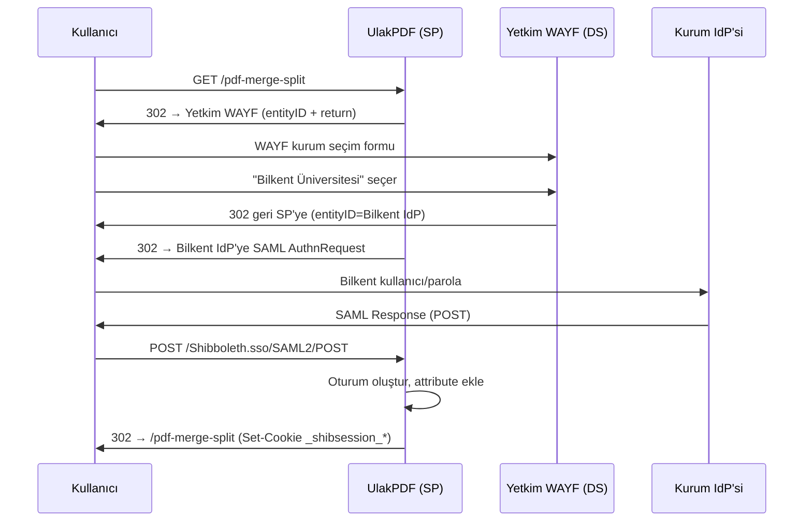

# Yetkim IdP Entegrasyonu

UlakPDF, Yetkim federasyonuna **Service Provider (SP)** olarak katılır.
SAML2 protokolü Shibboleth SP üzerinden işlenir.

## Yetkim canlı endpoint'leri

Aşağıdaki değerler Yetkim portalinden doğrulanmıştır (Mayıs 2026):

| Servis | URL |
|---|---|
| **Federasyon metadata** | `https://md.yetkim.org.tr/yetkim-metadata.xml` |
| **Discovery Service (WAYF)** | `https://ds.yetkim.org.tr/` |
| **Test ortamı** | `https://test.yetkim.org.tr` |
| **F-Ticks log host** | `log.yetkim.org.tr:4513` (Yetkim+eduGAIN) veya `:4512` (sadece Yetkim) |

Federasyon metadata XML imzalıdır; `validUntil` tipik olarak 10 gün,
`cacheDuration` 5 saat. shibd bunu otomatik refresh eder.

## İki mod

UlakPDF SP'si iki şekilde çalışabilir:

| Mod | Ne zaman | `.env` |
|---|---|---|
| **Federasyon (önerilen)** | Birden çok kurumdan kullanıcı kabul edilecek | `IDP_DISCOVERY_URL` set, `IDP_ENTITY_ID` boş |
| **Tek-IdP** | Yalnızca tek bir kurumun kullanıcıları | `IDP_ENTITY_ID` set, `IDP_DISCOVERY_URL` boş |

Mod, `.env`'deki `IDP_DISCOVERY_URL` değişkeniyle seçilir; entrypoint
boot'ta `<SSO>` blogunu uygun şekilde render eder.

## Federasyon-modu akışı



Federasyon-modunun avantajı: tek WAYF üzerinden tüm Yetkim üyesi
kurumların kullanıcıları girebilir. SP yapılandırması her kurum için
ayrı tutulmaz.

## SP olarak Yetkim'e kayıt

### Vereceğiniz bilgiler

| Alan | Değer |
|---|---|
| **SP Entity ID** | `https://<sunucunuz>/shibboleth` |
| **SP Metadata URL** | `https://<sunucunuz>/Shibboleth.sso/Metadata` |
| **Teknik İletişim** | `.env` içindeki `SUPPORT_CONTACT` |
| **ACS URL** | `https://<sunucunuz>/Shibboleth.sso/SAML2/POST` |
| **SLO URL** | `https://<sunucunuz>/Shibboleth.sso/SLO/POST` |

ACS ve SLO URL'leri metadata içinde otomatik bildirilir; Yetkim genelde
sadece metadata URL'ini ister.

### Talep edeceğiniz attribute'lar

UlakPDF'in tam çalışması için aşağıdakileri Yetkim'in salması gerekir:

| Attribute | Zorunluluk | Kullanım |
|---|---|---|
| `eduPersonPrincipalName` (eppn) | **Zorunlu** | Yönetici listesi, istatistik anahtarı |
| `mail` | Önerilen | Navbar'da gösterilir |
| `displayName` | Opsiyonel | Tam ad gösterimi |
| `givenName`, `sn` | Opsiyonel | İleride personalize için |
| `eduPersonAffiliation` | Opsiyonel | Rol bazlı gösterim, istatistik |

Yetkim self-servis portalde "Attribute Release" sayfasından bunlar tek
tek seçilir.

## Federasyon metadata imzası

Production'da kesinlikle metadata imzasını doğrulamalısınız. Yoksa
Man-in-the-Middle saldırgan, sahte IdP metadata yayınlayıp kullanıcıları
sahte IdP'ye yönlendirebilir.

### Adımlar

1. Yetkim'den federasyon signing sertifikasını alın (genelde X.509 PEM).
2. `nginx-shib/shibboleth/federation-cert.pem` olarak kaydedin.
3. `nginx-shib/shibboleth/shibboleth2.xml` düzenleyin:

```xml
<MetadataProvider type="XML" url="${IDP_METADATA_URL}"
                  backingFilePath="idp-metadata.xml"
                  maxRefreshDelay="7200">
    <MetadataFilter type="RequireValidUntil" maxValidityInterval="2419200"/>
    <MetadataFilter type="Signature" certificate="federation-cert.pem"/>
</MetadataProvider>
```

4. Yeniden derle:

```bash
cd /opt/spdf
bash deploy/deploy.sh
```

## SP keypair (signing/encryption)

UlakPDF ilk açılışta kendi SP keypair'ini üretir ve `shib-state` named
volume'unda saklar.

- Anahtarlar 5 yıl geçerlidir.
- Kaybedilirse: yeni anahtarlar üretilir, ancak **eski metadata Yetkim'de
  geçersiz kalır** ve Yetkim'e yeni metadata vermeniz gerekir.

### Yedek alma (kritik)

```bash
docker run --rm \
    -v ulakpdf_shib-state:/data \
    -v $(pwd):/backup \
    alpine tar czf /backup/shib-state-$(date +%F).tar.gz -C /data .
```

Yedeği güvenli bir yere kopyalayın (örn. ayrı bir backup VM, S3 vb.).

### Geri yükleme

```bash
docker run --rm \
    -v ulakpdf_shib-state:/data \
    -v $(pwd):/backup \
    alpine tar xzf /backup/shib-state-2026-05-13.tar.gz -C /data
docker compose -f deploy/docker-compose.prod.yml restart nginx-shib
```

## Attribute name format uyumsuzluğu

Bazı IdP'ler attribute'ları `urn:oasis:names:tc:SAML:2.0:attrname-format:basic`
formatında salar, bazıları `urn:oasis:names:tc:SAML:2.0:attrname-format:uri`
ile. UlakPDF'in `attribute-map.xml`'i HER İKİSİNİ de kabul eder
(`nameFormat` attribute'lı OID + friendly name eşlenmiştir).

Eğer Yetkim "Attribute received but not extracted" hatası verirse, shibd
log'una bakın:

```bash
docker exec ulakpdf-nginx-shib tail -50 /var/log/shibboleth/shibd.log \
    | grep -i 'skipping\|nameFormat'
```

## Test

Yetkim entegrasyonunun çalıştığını test etmek:

1. `https://<sunucunuz>/Shibboleth.sso/Login?target=/`
2. Yetkim kurum seçimi
3. Kurum IdP'sinde giriş
4. Geri dönünce `https://<sunucunuz>/Shibboleth.sso/Session`
   sayfasında attribute'larınız görünmeli.

`Session` sayfası IP-based ACL ile sınırlıdır (varsayılan: localhost ve
docker bridge); production'da dışarıdan erişmek isterseniz
`shibboleth2.xml`'deki Handler'ın `acl=""` değerini güncelleyin.
