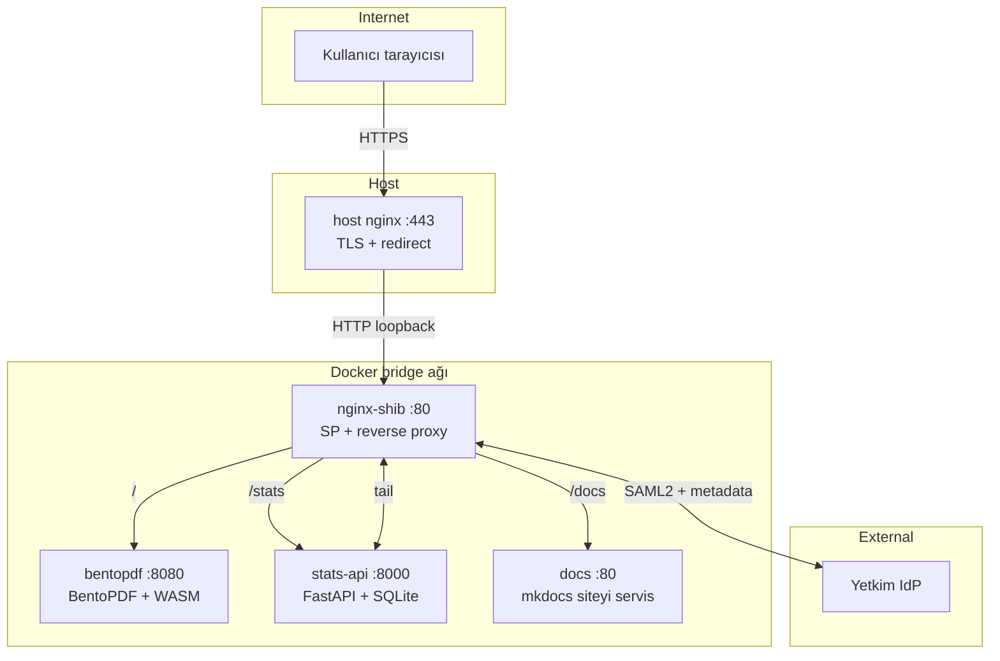

# Mimari

UlakPDF, küçük amaçlı bileşenlerden oluşan bir Docker stack'idir. Her
container tek bir iş yapar; aralarındaki sınırlar nettir.

## Genel bakış



## Container'lar

### `host nginx` (sistem servisi)

- TLS terminator, certbot/Let's Encrypt ile renewal
- `http://` → `https://` redirect (port 80)
- `127.0.0.1:8081` üzerinden docker stack'e proxy
- `X-Forwarded-Proto: https`, `X-Forwarded-Host`, `X-Forwarded-For`
  header'ları ile arka tarafa scheme bilgisini taşır

### `nginx-shib`

Çok fonksiyonlu container:

- **nginx** (kaynaktan derlenmiş + `nginx-http-shibboleth` dynamic
  module + `headers-more`)
- **shibd** (Shibboleth SP daemonu)
- 2× **FastCGI helper**: `shibauthorizer` (auth check) ve `shibresponder`
  (`/Shibboleth.sso/*` handler'ları)

Sorumlulukları:

- Yetkim ile SAML2 round-trip'i yönetir
- Her korumalı isteğe `X-Remote-User`, `X-Remote-Mail`, `X-Remote-Affil`
  header'larını ekler (shibauthorizer'dan gelen Variable-* response
  header'larını okur)
- Anonim ziyaretçileri `/landing`'e yönlendirir, oturumluları
  BentoPDF'e geçirir
- Statik admin panel (`/stats/`) ve dokümantasyon (`/docs/`) dosyalarını
  servis eder veya proxy yapar

### `bentopdf`

- Statik HTML + JS + WASM modülleri (~80 MB, alpine nginx ile)
- Tüm PDF işleme tarayıcıda olur; bu container sadece dosya servisidir
- Custom build: `VITE_BRAND_NAME=UlakPDF` ve footer metni inject edilir,
  ayrıca `overlay/` üzerinden Ulakbim mavisi accent'lı light tema +
  tema toggle butonu eklenir

### `stats-api`

- FastAPI + Uvicorn (Python 3.12)
- Paylaşılan named volume'dan (`nginx-logs`) `stats.log`'u tail eder
- JSON satırları parse edip SQLite'a kaydeder
- `/api/{summary,by-institution,by-tool,timeline,recent,admins}` uç
  noktalarını yöneticilere açar; `ADMIN_EPPNS` listesi ile gate

### `docs`

- Multi-stage build: mkdocs-material derler, sonuç alpine nginx ile
  servis edilir
- nginx-shib'e proxy ile bağlanır (`/docs/` location)
- Public — anonim ziyaretçi de okuyabilir

## Trafik akışları

### Anonim ziyaret

```
GET /  →  nginx-shib
nginx-shib: _shibsession_* çerezi yok → 302 /landing
GET /landing  →  nginx-shib: alias /etc/nginx/landing/index.html → 200
```

Kullanıcı tarayıcısında UlakPDF karşılama sayfası belirir. **PDF
araçlarına erişemez** çünkü `/pdf-*` ve `/` Shibboleth-gated.

### Giriş + araç kullanımı

```
1) Click "Yetkim SSO"  →  GET /Shibboleth.sso/Login?target=/
2) shibd 302  →  Yetkim IdP'ye SAML AuthnRequest
3) Yetkim formu → kullanıcı giriş yapar → SAML Response (POST)
4) POST /Shibboleth.sso/SAML2/POST  →  shibd oturum oluşturur,
   _shibsession_* çerezini set eder → 302 /
5) GET /  →  shib_request /shibauthorizer içeride çağrılır
              → 200 + Variable-eppn, Variable-mail, ... header'ları
              → nginx X-Remote-* header'ları olarak BentoPDF'e iletir
              → cevap: BentoPDF HTML + Set-Cookie spdf-user=<eppn>
6) Tarayıcı BentoPDF JS'i yükler; theme-toggle.js spdf-user çerezini
   okuyup eppn + Çıkış butonunu navbar'a enjekte eder.
```

### İstatistik toplama

```
Her korumalı istek  →  shib-protect snippet
                     →  access_log stats.log
                          {ts, ip, eppn, mail, affil, method, uri, status, bytes, ua}
                          (JSON satır)
nginx-logs named volume  ←  paylaşılır
stats-api tail loop      ←  /logs/stats.log
                            JSON parse → SQLite insert
```

### Yönetici paneli görüntüleme

```
GET /stats/  →  shib-protect (gerek)  →  alias /etc/nginx/stats-admin/index.html
JS:
  fetch /stats/api/summary  →  nginx-shib reverse proxy → stats-api:8000
  stats-api: require_admin(X-Remote-User) → eppn ADMIN_EPPNS içindeyse
             200 + JSON, değilse 403 → dashboard "Yetkisiz" gösterir
```

## Veri akışı sınırları

| Veri | Server'da kalır mı? |
|---|---|
| Yüklenen PDF | **Hayır** — tarayıcıda işlenir, sunucuya gönderilmez |
| eppn / mail / affil | Evet — stats DB'de ve nginx loglarında |
| IP adresi | Evet — nginx access logunda |
| Tarayıcı User-Agent | Evet — nginx access logunda |
| Hangi araç sayfası açıldı | Evet — URI istatistikte |
| Hangi dosya işlendi | **Hayır** — sunucu bilmez |

Bu, **gizliliğin temel teknik garantisi**dir: dosyalar hiçbir zaman
sunucuya gitmez. Sunucu yalnızca "kim hangi sayfayı açtı"yı görür.

## Build artifacts

| Image | Build context | Boyut |
|---|---|---|
| `ulakpdf-nginx-shib` | `nginx-shib/` | ~300 MB |
| `ulakpdf-bentopdf:branded` | `bentopdf/` | ~80 MB |
| `ulakpdf-stats-api` | `stats-api/` | ~150 MB |
| `ulakpdf-docs` | `docs-site/` | ~25 MB |

Toplam ~550 MB disk; ilk derleme ~5 dakika (nginx kaynaktan derlenir,
bentopdf'in npm install'ı süre alır).

## Persistent state

Docker named volume'ları:

| Volume | İçerik | Yedeklenmeli mi? |
|---|---|---|
| `ulakpdf_shib-state` | SP keypair, IdP metadata cache | **Evet** (kayıp = Yetkim re-register) |
| `ulakpdf_stats-db` | Stats SQLite | Tercihen (kayıp = geçmiş istatistik) |
| `ulakpdf_nginx-logs` | Container nginx + shibd logları | Hayır (logrotate yönetir) |

## Yatay ölçek

Şu an tek instance. Yatay genişletmek için:

- **nginx-shib**: shibd in-memory session cache'i var; replica'lar arası
  paylaşımı için `<StorageService>` blogunda memcached/redis ekle
- **stats-api**: SQLite tek-yazıcı; PostgreSQL'e geçilirse multi-replica
  kolay
- **bentopdf / docs**: stateless, n kopya çalıştır

Beklenen ölçek (binlerce kullanıcı/gün) için tek instance bol gelir;
darboğaz çıkarsa bandwidth'tir, CDN ile çözülür.
